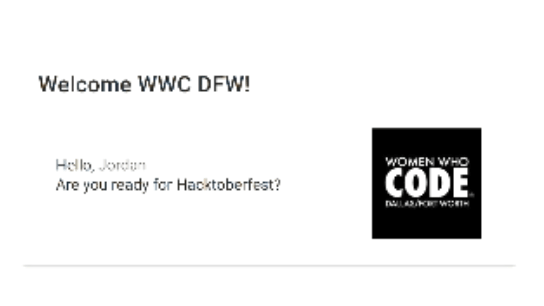

# hello-hacktoberfest

This is basically a hello world app built with Vue, Vuetify, and RxJS. The purpose of this app is to provide a simple-yet-realistic repository to be used as a practice space for an educational git/github workshop. The names in the initial list are the leadership team of [WWC DFW][carrd] as of September 2020.



# Workshop

The goal of the workshop is to practice the steps of making a fork, clone, commit, and pull request. During the workshop, you will submit a pull request to this repository which adds your name to the list of names in the file at [/src/data/names.json][names.json]

1. Fork this repository
2. Clone that fork to your local computer
3. Add your name to the list in the names.json file
4. Commit that change and push it to your remote repository on GitHub
5. Open a pull request from the fork back to the original repository

# Local Development

You shouldn't need to actually run this application yourself in order to make the change. That said, if you want to play with it, you are more than welcome to do so. You will need to have a reasonably up to date version of node.js installed on your computer. Once that is done, you can open a terminal and navigate to the folder where you cloned the repository. Then run the below commands in your terminal to setup your development environment and run the app.

This app was built with the Vue-CLI. If you're familiar with that tool, then this will all be familiar. If you haven't used Vue before, this app is a very basic example of that framework.

## Project setup
```
npm install
```

### Host the app with development features enabled
```
npm run serve
```

### Compiles and minifies for production
```
npm run build
```

### Lints and fixes files
```
npm run lint
```

[carrd]: https:wwcdfw.carrd.co
[names.json]: https://github.com/jenniferplusplus/hello-hacktoberfest/blob/main/src/data/names.json
